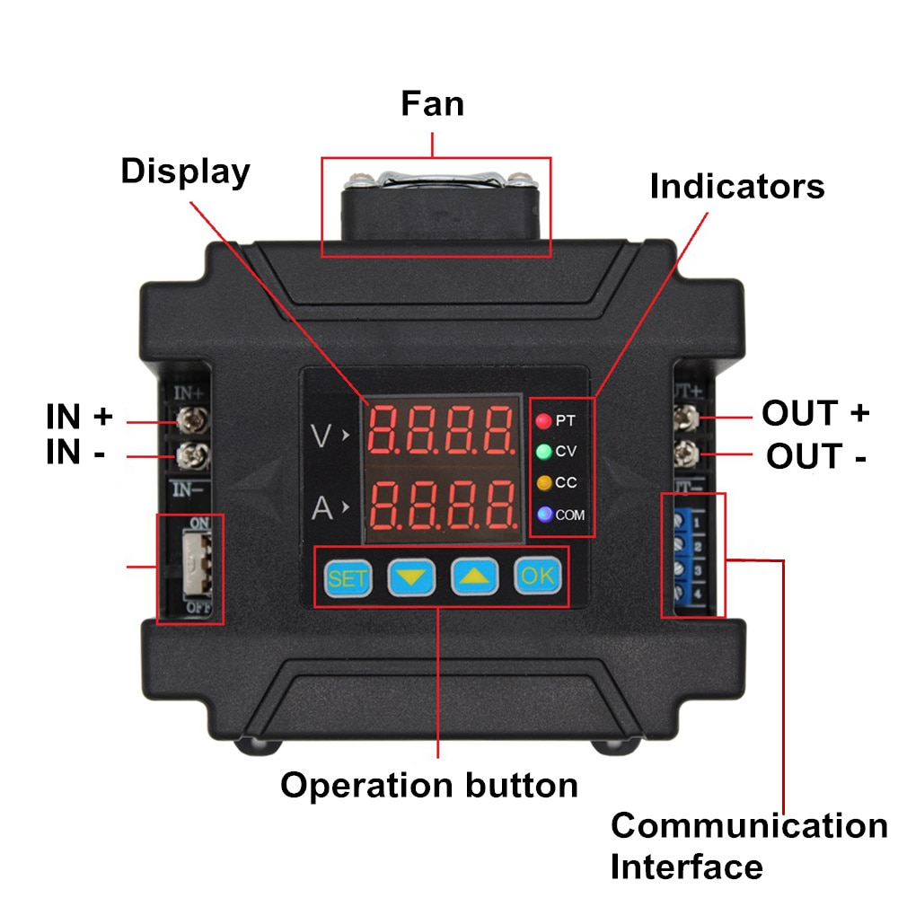

# DPM8600

DPM8600 is an Arduino library for controlling DPM8600 series power converters (DPM8605, DPM8608, DPM8616 and DPM8624). The library uses Serial communication for sending and receiving commands using [this protocol](https://www.mediafire.com/folder/ds68ouh6f4lx7/DPM8600_Data).

## Table of Contents

* [General Information](#general-information)
* [Setup](#setup)
* [Declaration](#declaration)
* [Function Descriptions](#function-descriptions)
    * [Initialization](#initialization)
    * [Power Switching](#power-switching)
    * [Write Command](#write-command)
    * [Write Voltage and Current](#write-voltage-and-current)
    * [Read Command](#read-command)
* [Errors](#errors)
* [Roadmap](#roadmap)
* [Contributing](#contributing)
* [License](#license)
* [Contact](#contact)


<!-- GENERAL INFORMATION -->
## General Information

* This library only works for **TTL** version of the converter, not RS-485.
* Serial communication happens over 5V so use a level converter if your arduino runs at 3.3V.
* DPM8600 take about 0.6s to turn on an adjust the settings, so turning on the power and immedeately getting the readings will occasionally produce erroneous measurements.
* Current resolution is 3 decimal places, while voltage is 2 decimal places.

## Setup



As can be seen on the image on above, there several main component to working with DPM8600 power converters. First, In+ In- indicates where the input needs to be connected (10-75V). Then Out+ Out- is for the output. Finally communication is done through ports 1-4:

1 - Power

2 - Data out (->)

3 - Data in (<-)

4 - Ground

If using Arduino with the same 5V serial (e.g Uno), you only need to connect ports 2-4. However, if your Arduino is 3.3V (e.g MKR1010) then you have to use a [level converter](https://www.sparkfun.com/products/12009) to step between different voltages, and to power that converter you would have to use port 1 as well.

<!-- DECLARATION -->
## Declaration

```cpp
DPM8600(int8_t address = 1) 
```
Creates a new DPM8600 object with a different address (1-99). The address can be changed manually on the power converter.

e.g. DPM8600 converter(2); - creates a converter object with address = 02

e.g. DPM8600 converter; - creates a converter object with address = 01


<!-- FUNCTION DESCRIPTIONS -->
## Function Descriptions

### Initialization
```cpp
int begin(HardwareSerial Serial, int8_t maxRetry = 3);
```
Initializes the power converter. Required upon starting up. Serial **has to be initiated beforehand** with the correct **baud rate** of the power converter (Default is 9600). Check out the example code if confused.

* Serial - pass a reference for a hardware serial. 
* maxRetry - maximum number of retries if the connection fails. Default = 3

Returns 1 on success or a negative integer for an error.

---

### Power Switching
```cpp
int power(bool on);
```
Turns the power on / off.

Returns 1 on success or a negative integer on error.

---

### Write Command
```cpp
int write(char cmd, float value);
```

Writing command sets the corresponding property on the power converter. 

E.g. write('c', 3.21) set current limit on the converter to 3.21A 

List of commands:

* 'v' or 'V' - sets voltage limit. Value range: 0 - 60V.
* 'c' or 'C' - sets current limit. Value range: 0 - max available for the converter (e.g. DPM8616 has max current of 16A).
* 'p' or 'P' - sets the power on or off. Works same as [`power(bool on)`](#power-switching). Value is 0 (off) or 1 (on), anything else will produce error -20.

Returns 1 on success or a negative integer on error.

---

### Write Voltage and Current
```cpp
int write(float v, float c);
```

Writing command that sends both voltage and current at the same time.
Both voltage and current are float and are in Volts and Amps respectively.

Returns 1 on success of a negative integer on error.

---

### Read Command

```cpp
float read(char cmd);
```

Reading function returns Float state values of the specified command. List of commands:

* 'v' or 'V' - returns voltage in Volts.
* 'c' or 'C' - returns current in Amps.
* 'p' or 'P' - returns power state. 0 - power off, 1 - power on.
* 's' or 'S' - returns CC / CV status. 0 - CV, 1 - CC.
* 'm' or 'M' - returns max current of the power converter in Amps (e.g. 5, 8, 16 or 24).
* 't' or 'T' (or any other character) - returns the internal temperature of the power converter in Celcius.

Returns a positive float value on success, or negative **float** on error.

---

<!-- ERRORS -->
## Errors

Errors are returned as **negative** values (integers or floats).
E.g. read('v') can return -10 (float), which indicates an error. This way you can always monitor your code.

Error list:

  -1 - error on begining DPM8600.

  -10 - error on voltage reading.

  -11 - error on current reading.

  -12 - error on power reading.

  -13 - error on CC/CV reading.

  -14 - error on max current reading.

  -15 - error on temperature reading.

  -16 - value outside boundaries.

  -20 - wrong value or command sent to power writing function.

  -21 - error setting current.

  -22 - error setting power on/off.

  -23 - error setting voltage.

  -24 - error setting current and voltage.

  -25 - wrong writing command.

<!-- ROADMAP -->
## Roadmap

See the [open issues](https://github.com/Lotiq/SMART_Wire/issues) for a list of proposed features (and known issues).


<!-- CONTRIBUTING -->
## Contributing

Contributions are what make the open source community such an amazing place to be learn, inspire, and create. Any contributions you make are **greatly appreciated**.

1. Fork the Project
2. Create your Feature Branch (`git checkout -b feature/AmazingFeature`)
3. Commit your Changes (`git commit -m 'Add some AmazingFeature'`)
4. Push to the Branch (`git push origin feature/AmazingFeature`)
5. Open a Pull Request


<!-- LICENSE -->
## License

Distributed under the MIT License. See `LICENSE` for more information.


<!-- CONTACT -->
## Contact

Timothy Lobiak - [linked-in](http://linkedin.com/in/timothy-lobiak-045792151) - timothylobiak@gmail.com
